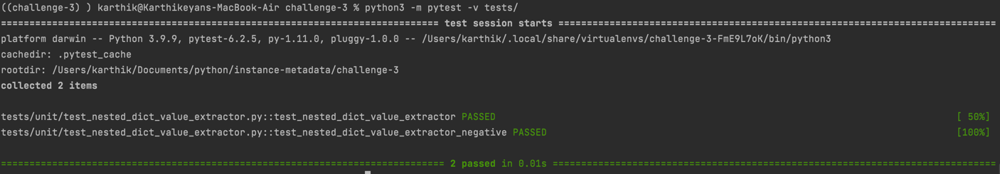

# challenge-3
Get value from nested dictionary

Unit test can be run from pipenv as below, 

```
python3 -m pytest -v tests/
```

or you can do, 

```
pipenv install  # to install pytest
pipenv shell python3 -m pytest -v tests/  # to execute the test
```


